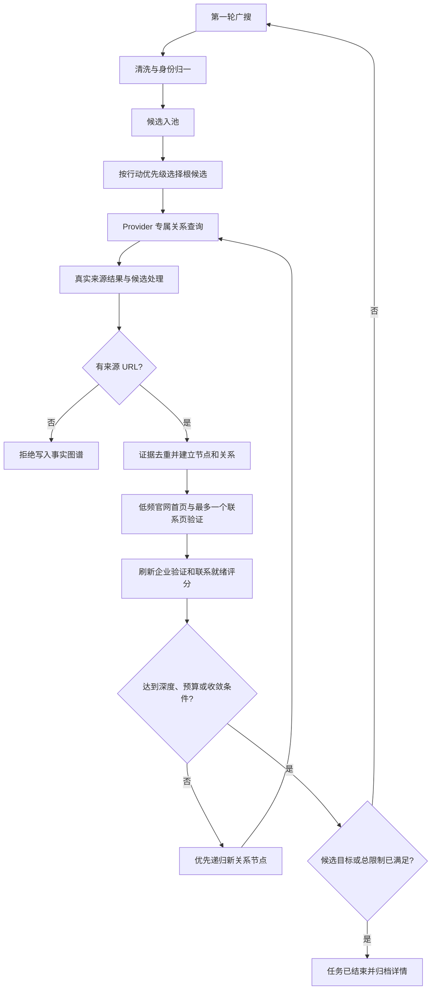

# GoodJob CRM 候选级深度挖掘闭环

版本：v1.0  
状态：后端、前端、恢复机制与专项测试已实现  
实现日期：2026-07-31

## 1. 目标

深度挖掘不是扩大抓取范围，而是在已有真实候选上继续寻找可追溯的企业关系、采购信号和公开联系入口。系统继续使用已授权 API、官方开放数据和低频官网验证，不运行爬虫、不模拟浏览器、不绕过登录、验证码、付费墙或 robots。

完成后的任务必须能够回答：

1. 为什么选择这家企业继续研究。
2. 围绕它向哪些 Provider 提交了什么查询。
3. 新企业或新关系来自哪个 URL、哪个 Provider、什么时间。
4. 证据是官方、交叉佐证、发现级还是 AI 辅助级。
5. 企业验证、联系就绪和行动优先分别是多少分。
6. 为什么继续、收敛、停止或失败。
7. 服务重启后从哪里恢复。

## 2. 四轮专业评审

### 第一轮：业务价值与事实边界

外贸销售认为单纯增加搜索轮次不能称为深挖，需要从目标企业继续寻找经销、供应、采购、中标、项目和区域代表关系。数据工程师指出，模型不能直接创建这些关系；关系必须从 Provider 结果和来源 URL 中提取。合规人员要求官网访问保持低频、同域、robots 优先和最小正文读取。

结论：采用候选级证据图谱；AI 只扩展查询，不写企业事实。

### 第二轮：覆盖广度与递归深度

销售希望尽量多研究根候选，研究人员希望能沿重要关系继续第二、第三层。SRE 指出同时广搜所有根候选和递归所有关系会导致预算不可控。产品经理要求用户只选择平衡、深度、极限，不增加复杂参数表单。

结论：第一轮广搜，后续广搜与深挖交替；新关系节点优先递归，再回到未研究根候选。三档限制如下：

| 模式 | 最大关系深度 | 最大根候选 | 深挖查询预算 | 官网验证预算 |
| --- | ---: | ---: | ---: | ---: |
| 平衡 | 1 | 3 | 3 | 2 |
| 深度 | 2 | 10 | 7 | 5 |
| 极限 | 3 | 20 | 15 | 10 |

所有预算仍受超级搜索总轮次、时间和费用上限约束。

### 第三轮：自动完成与人工资格

原实现使用 RRQ 数量判断搜索是否完成，但 RRQ 和 VQA 包含人工审批，自动任务可能永远无法达标。销售需要搜索任务能自行结束，同时保留后续人工资格流程。

结论：搜索目标改为真实入池候选数；`researchReadyCount` 作为深挖验收；RRQ 和 VQA 继续显示在任务详情，但不阻塞自动搜索结束。顶层终态统一显示“任务已结束”，部分成功、失败来源和清洗去向仅在详情展示。

### 第四轮：恢复、幂等与审计

数据工程师要求关系和证据幂等，SRE 要求进程重启后不丢任务，产品经理要求实时反馈不变成卡片阵列。官网探针存在一个特殊问题：数据库能恢复探针状态，但内存执行队列会随进程退出消失。

结论：深挖状态嵌入 Mission JSON，沿用 MySQL 团队隔离和持久化；证据、节点、边和任务使用稳定键去重；官网探针增加幂等恢复调度器；主界面以连续对话打印当前对象、层级、证据和关系累计，完整审计放在详情。

## 3. 运行闭环



## 4. Provider 查询分工

同一轮不再把同一份查询发送给所有来源：

| 来源职责 | 查询重点 |
| --- | --- |
| Web Search API | 企业名、产品、子公司、经销商、伙伴、供应商、项目和当地语言表达 |
| 地图 API | 企业名、区域、经销商、代理、供应商和真实业务场景 |
| 采购/招标 API | 企业名、RFQ、tender、contract award、procurement 和 approved supplier |
| 企业登记/身份 API | 企业名称或强标识精确查询，不混入采购和客户类型词 |
| AI 搜索 | 企业名、source-backed relationship、official source 和 public evidence |

每个 Provider 查询保存在 `providerResolvedQueries`。主查询指纹保持旧任务兼容，Provider 查询集合使用独立 SHA-256 指纹，MySQL 严格 schema 和运行前校验会拒绝篡改。

## 5. 证据图谱

`ProspectDeepMiningState` 随超级搜索 Mission 一起保存：

- `tasks`：候选级查询、官网验证、状态、轮次、重复量和停止原因。
- `nodes`：根候选与关联候选、父节点、深度、三项评分和冲突状态。
- `edges`：关系类型、置信度、验证状态、来源 URL 和证据引用。
- `evidence`：Provider、URL、摘要、查询词、权威等级、时间和载荷摘要。
- `summary`：根候选、研究节点、关系、证据、验证企业、联系就绪和研究就绪数量。

支持的关系：母子公司、品牌与经销、买卖方、业主与承包商、采购中标、认证伙伴、区域代表、公开联系渠道和来源关联企业。

只有真实 Provider 结果中存在 `sourceUrl` 或官方网址时才允许写入证据和关系。AI 摘要没有来源时不会创建节点或边。

## 6. 四项评分

候选详情分别展示，不再把 Provider 的 `confidence` 当作真实性：

| 分数 | 含义 | 主要依据 |
| --- | --- | --- |
| 发现相关度 | 当前结果与查询目标的相关程度 | Provider 返回和匹配字段，仅用于发现排序 |
| 企业验证分 | 企业主体是否真实且被佐证 | 官方身份、官网域名、跨来源一致性和冲突 |
| 联系就绪分 | 是否存在可用且合规的联系入口 | 公开业务邮箱、渠道有效性和人工联系批准 |
| 行动优先级 | 是否值得销售优先处理 | 企业验证、ICP、联系就绪、合规和业务信号组合 |

`researchReadyCount` 要求企业验证分至少 70 且节点有可追溯证据。它代表“研究材料可用”，不等同于人工批准联系。

## 7. 官网低频验证 v3

每个团队和域名串行执行，默认团队请求间隔 3 秒：

1. 只接受无凭据的 HTTPS 公网域名和标准 443 端口。
2. 校验全部 DNS 地址，阻止内网、回环和非公网目标。
3. 先读取 robots.txt；禁止时立即停止。
4. HEAD 检查首页状态、MIME 和声明大小。
5. GET 首页，单页最多 64 KiB，不保存 HTML 原文。
6. 只从首页真实链接中选择最多一个同主机联系页，例如 contact、kontakt、impressum、contacto、contatti 或 about。
7. 联系页再次检查 robots，单页仍最多 64 KiB。
8. 仅保留组织弱证据、同域公开业务邮箱、来源 URL、观察时间和载荷摘要。
9. 同团队同域 24 小时复用缓存；连续三次瞬时失败后熔断 24 小时。
10. 进程重启后，数据库中未结束的探针由幂等恢复调度器续跑。

## 8. 实时反馈

主界面连续打印：

- 当前广搜轮次、主题、来源进度和原始返回。
- 清洗去除、候选入池和最新候选。
- 当前深挖企业、所在层级、查询预算和官网验证状态。
- 最近一条真实证据摘要。
- 研究节点、关系、证据和研究就绪累计。
- 任务终态统一为“任务已结束”。

任务详情展示：

- 根候选、父节点和关系类型。
- 企业验证、联系就绪和行动优先评分。
- 关系验证分与是否交叉佐证。
- Provider、证据摘要和原始来源链接。
- 每个任务的无新证据、重复收敛、预算、深度、失败或人工停止原因。
- 原有来源成功/失败、清洗合并/排除、RRQ 和 VQA。

## 9. 停止条件

硬停止：最长时间、费用上限、费用回执异常、最大总轮次、用户取消或任务失败。

深挖停止：最大深度、查询预算、官网验证预算、没有带来源的新证据、证据已存在、关系循环或任务结束。

收敛停止：连续两轮有效率低于 3% 且重复率高于 90%。

候选目标达到后，系统先完成已经进入队列且仍在预算内的深挖任务，再结束 Mission。达到总轮次时，剩余深挖任务统一标记 `stopped` 并保存原因。

## 10. 持久化和隔离

- 深挖状态保存在 `prospect_super_search_missions.mission_json`。
- Round 的深挖类型、焦点候选、焦点节点和深度保存在 `rounds_json`。
- 深挖实时事件和 metadata 保存在 `events_json`。
- Run 的 Provider 专属查询进入不可变执行快照，并参与快照哈希。
- 官网探针及证据继续保存在候选记录中。
- 所有候选、任务、探针和查询都校验 `teamId + ownerId`。
- 管理员只能读取本团队；业务员只能读取本人；超级管理员默认不能创建团队搜客任务。

本次没有新增 SQL 表，因此现有 MySQL 迁移不需要增加结构；旧 Mission、Round 和 Run 没有新字段时仍能读取。

## 11. 自测结果

已自动验证：

- Provider 按职责获得不同查询，查询集合被篡改时校验失败。
- Web 深层 URL 能恢复为官网域名。
- 根候选选择、递归优先、最大深度和查询预算。
- 同一证据幂等、同一关系不重复、关系循环不重复入队。
- 无来源事实拒绝进入图谱。
- 团队隔离和 Mission JSON 重启恢复。
- 自动完成使用候选目标，不再等待人工 RRQ。
- 官网首页、联系页、robots、SSRF、MIME、大小、缓存、熔断和重启续跑。
- 深挖 metadata 正确进入实时事件流。
- 顶层终态保持“任务已结束”，详细成败仅在详情。
- 超级搜索、普通 Run、执行内核、Scheduler、Provider、原始证据和请求账本回归通过。
- 后端、前端和 WhatsApp 插件生产构建通过。

专项命令：

```bash
npm run test:prospect-deep-mining --workspace backend
npm run test:prospect-super-search --workspace backend
npm run test:website-probe --workspace backend
npm run test:prospect-live-events --workspace backend
npm run test:prospect-verification --workspace backend
npm test --workspace frontend
npm run build
```

## 12. 运行条件

深挖本身不要求新增 API，但结果质量取决于已配置来源。至少应有一个可用 Web Search API；地图、采购、企业登记和 AI 来源按市场按需配置。AI 未配置时，确定性规划器和全部非 AI 深挖仍可运行。官网探针可通过 `WEBSITE_PROBE_ENABLED=false` 全局关闭；关闭后关系 API 搜索继续执行，官网评分保持不变。
