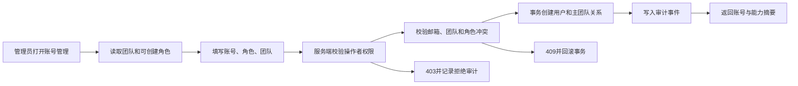

# GoodJob CRM 用户权限模块开发文档

## 1. 文档目标

本模块把当前的“固定角色 + 分散判断”升级为可审计、可配置、可回收的权限系统，覆盖：

- 用户、团队、角色、权限和额外授权。
- 页面显示、按钮显示、接口访问和数据范围。
- 账号创建、角色调整、团队调整、授权、撤销、停用、恢复、删除和转交。
- 业绩查看人选择、导出、批量操作、Agent 和外部发送。
- 权限变更后的即时回收、失败回滚、审计和测试。

本阶段只允许增加权限能力，不改变现有客户、线索、商机和账号数据。

## 2. 当前实现基线

当前系统已有四个角色：`sales`、`manager`、`admin`、`super_admin`。用户记录直接保存 `role` 和 `team_id`，没有正式的团队、角色、权限和授权关联表。

当前后端主要依赖 `canSeeOwner`、`canSeePersonalData` 以及散落在路由中的角色判断。当前前端通过 `data-role`、`data-scope` 和 CSS 隐藏部分入口。它们能提供基础隔离，但不能支持管理员配置权限，也不能作为安全边界。

当前已存在的行为必须在迁移后保持兼容：

| 角色 | 当前默认业务范围 | 当前个人数据范围 |
|---|---|---|
| 业务员 | 本人客户、线索、商机 | 本人待办、备忘录、个人配置 |
| 销售主管 | 本团队客户、线索、商机 | 本人待办、备忘录、个人配置 |
| 管理员 | 本团队业务和团队账号 | 本人待办、备忘录、个人配置 |
| 超级管理员 | 全局业务 | 本人待办、备忘录、个人配置 |

## 3. 设计原则

1. 后端授权是唯一安全边界，前端隐藏只负责体验。
2. 默认拒绝未知权限，新增页面或接口没有权限登记时不能发布。
3. 角色提供基础权限，用户额外授权只能扩大到固定目录允许的范围。
4. 权限不能扩大团队边界；`global` 只适用于明确登记的查询和报表。
5. 查看、编辑、删除、导出、审批、分配和外发必须拆成不同权限。
6. Agent、Skill、后台任务和人工操作使用同一个授权内核。
7. 权限变化必须可追溯、可过期、可撤销、可回滚。
8. 账号停用优先于删除；删除前必须完成业务转交或归档。

## 4. 权限模型

### 4.1 权限表达式

权限编码统一使用：

```text
<resource>.<action>.<scope>
```

示例：

```text
customer.read.self
customer.read.team
customer.create.self
customer.edit.team
customer.assign.team
performance.read.self
performance.select_owner.team
performance.export.team
account.manage.team
permission.grant.team
database.maintenance.team
communication.send.external
agent.execute.customer
```

`scope` 不是装饰字段，而是授权决策的一部分。接口必须同时校验权限编码、请求对象、团队、负责人和操作上下文。

### 4.2 数据范围

| 范围 | 含义 | 可用角色 |
|---|---|---|
| `self` | 当前用户本人负责或创建的数据 | 所有角色 |
| `team` | 当前用户所在团队的数据 | 主管、管理员、超级管理员 |
| `public` | 客户公池等明确标记为公共的数据 | 按具体权限开放 |
| `global` | 所有团队的数据 | 超级管理员，或管理员被明确授予只读全局权限 |

数据范围只能收窄，不能由请求参数扩大。业务员传入其他 `ownerId` 时，服务端必须强制改为当前用户；管理员传入其他团队 ID 时必须拒绝。

### 4.3 决策结果

统一授权函数返回结构化结果：

```json
{
  "allowed": true,
  "permission": "performance.read.team",
  "scope": "team",
  "teamIds": ["beta-001"],
  "ownerIds": ["u_sales_01", "u_sales_02"],
  "fieldMask": [],
  "reason": "角色基础权限"
}
```

拒绝时返回稳定错误码：

```text
AUTH_REQUIRED
PERMISSION_DENIED
TEAM_SCOPE_DENIED
OBJECT_SCOPE_DENIED
ROLE_ASSIGNMENT_DENIED
PERMISSION_GRANT_DENIED
ACCOUNT_STATE_DENIED
```

## 5. 数据库设计

### 5.1 `teams`

```text
id                 VARCHAR(64) PRIMARY KEY
name               VARCHAR(120) NOT NULL
status             active | disabled
created_by         VARCHAR(64) NOT NULL
created_at         DATETIME(3) NOT NULL
updated_at         DATETIME(3) NOT NULL
```

第一版不做团队层级。所有业务表继续保留 `team_id`，并为关键查询增加 `(team_id, owner_id)` 索引。

### 5.2 `roles`

```text
id                 VARCHAR(64) PRIMARY KEY
code               sales | manager | admin | super_admin
name               VARCHAR(80) NOT NULL
system_role        BOOLEAN NOT NULL DEFAULT TRUE
status             active | disabled
version            INT NOT NULL DEFAULT 1
```

第一版四个系统角色不可删除、不可改编码，不做嵌套角色和角色继承。

### 5.3 `permissions`

```text
code               VARCHAR(120) PRIMARY KEY
resource           VARCHAR(80) NOT NULL
action             VARCHAR(40) NOT NULL
scope              self | team | public | global
ui_key             VARCHAR(120) DEFAULT ''
grantable_by       JSON NOT NULL
sensitivity        normal | sensitive | external
status             active | deprecated
version            VARCHAR(20) NOT NULL
```

### 5.4 `role_permissions`

```text
role_id            VARCHAR(64) NOT NULL
permission_code    VARCHAR(120) NOT NULL
effect             allow
scope_override     self | team | public | global
PRIMARY KEY(role_id, permission_code)
```

### 5.5 `user_permission_grants`

```text
id                 VARCHAR(100) PRIMARY KEY
user_id            VARCHAR(64) NOT NULL
permission_code    VARCHAR(120) NOT NULL
scope_override     self | team | public | global
granted_by         VARCHAR(64) NOT NULL
reason             VARCHAR(500) NOT NULL
expires_at         DATETIME(3) NULL
status             active | revoked | expired
created_at         DATETIME(3) NOT NULL
revoked_at         DATETIME(3) NULL
revoked_by         VARCHAR(64) DEFAULT ''
```

第一版只支持额外 `allow`，不做任意用户级 deny。需要关闭基础权限时，通过角色版本调整完成，避免形成“角色允许、个人拒绝、团队又允许”的冲突矩阵。

### 5.6 `team_memberships`

第一版保留 `users.team_id` 作为主团队兼容字段，同时建立：

```text
user_id            VARCHAR(64) NOT NULL
team_id            VARCHAR(64) NOT NULL
membership_role    primary | additional
status             active | disabled
created_at         DATETIME(3) NOT NULL
PRIMARY KEY(user_id, team_id)
```

业务查询第一版只使用主团队，预留多团队扩展但不开放多团队编辑。

### 5.7 `permission_audit_events`

```text
id                 VARCHAR(100) PRIMARY KEY
actor_id           VARCHAR(64) NOT NULL
target_user_id     VARCHAR(64) DEFAULT ''
target_team_id     VARCHAR(64) DEFAULT ''
action             VARCHAR(80) NOT NULL
permission_code    VARCHAR(120) DEFAULT ''
before_json        JSON NULL
after_json         JSON NULL
reason             VARCHAR(500) DEFAULT ''
request_id         VARCHAR(100) NOT NULL
ip_hash            CHAR(64) DEFAULT ''
result             success | rejected | failed
created_at         DATETIME(3) NOT NULL
```

密码、API Key、SMTP 密码、Token 和密钥只能记录“已变更”，不能写入 `before_json` 或 `after_json`。

## 6. 角色基础权限

### 6.1 业务员

- 可查看和维护本人客户、线索、商机。
- 可查看和使用自己的 Communication、开发信、待办和备忘录。
- 只能查看自己的业绩。
- 不显示账号管理、系统设置、数据库维护和团队报表入口。
- 不能分配负责人、跨团队查询、导出团队数据或授予权限。

### 6.2 销售主管

- 拥有业务员的全部基础权限。
- 可查看本团队客户、线索、商机和团队业绩。
- 可选择本团队业务员查看业绩。
- 可分配本团队线索、客户和商机。
- 可维护训练、题库、团队日报和团队知识。
- 不可创建账号，不可授予权限，不可查看员工个人待办和备忘录。

### 6.3 管理员

- 拥有主管的业务查看能力。
- 可管理本团队业务员和主管账号。
- 可给本团队业务员和主管授予权限目录中的额外权限。
- 可查看本团队经营数据和审计数据。
- 可维护本团队 AI、搜客和业务配置。
- 默认不能管理其他团队、管理员或超级管理员。

### 6.4 超级管理员

- 可管理全部团队、管理员、角色和权限目录。
- 可授予跨团队和全局只读权限。
- 可查看全局经营数据、全局审计和系统健康。
- 可维护系统级配置和数据库维护。
- 不能停用自己，不能删除最后一个活跃超级管理员。

## 7. 权限和界面绑定

所有页面进入统一注册表：

```json
{
  "key": "customers",
  "viewPermission": "customer.read.self",
  "actions": {
    "create": "customer.create.self",
    "edit": "customer.edit.self",
    "assign": "customer.assign.team",
    "export": "customer.export.team"
  }
}
```

页面启动后调用：

```http
GET /api/auth/capabilities
```

处理规则：

1. 没有 `viewPermission`：导航、快捷入口和深链页面都不可用。
2. 没有 action 权限：按钮不渲染，不仅仅是 disabled。
3. 有页面权限但对象不属于当前范围：显示无权操作状态。
4. URL、Agent、导出和批量请求必须再次经过后端授权。
5. 新增页面未登记权限编码时，构建检查失败。

## 8. 账号和授权操作闭环

### 8.1 新增账号



闭环要求：

- 管理员只能创建本团队业务员和主管。
- 超级管理员才能创建管理员和超级管理员。
- 初始密码只在创建响应或一次性凭据文件中出现，不能写日志。
- 创建失败时用户、团队关系和审计一起回滚。

### 8.2 修改角色或团队

1. 校验操作者的 `account.role.change` 权限。
2. 校验目标账号不能是当前账号。
3. 校验不能降权最后一个超级管理员。
4. 校验目标团队和新角色组合合法。
5. 校验客户、线索、商机、任务和 Agent 任务的转交计划。
6. 事务更新角色、团队关系、权限快照和 `auth_version`。
7. 旧会话立即失效，后台任务进入暂停或转交状态。
8. 写入 before/after 审计，返回新的能力摘要。

### 8.3 授予额外权限

1. 管理员选择目标成员和权限。
2. 后端读取操作者当前有效权限，不信任前端权限列表。
3. 验证目标成员在操作者可管理的团队内。
4. 验证权限属于固定目录且 `grantable_by` 包含操作者角色。
5. 验证授权范围不超过操作者范围。
6. 要求填写理由，可选设置过期时间。
7. 事务写入授权记录和审计事件。
8. 使目标用户能力缓存失效，下一次请求立即使用新权限。
9. 返回权限生效时间、范围和撤销入口。

### 8.4 撤销权限

1. 选择用户级授权记录，而不是修改角色基础权限。
2. 校验撤销者拥有 `permission.revoke.*` 能力。
3. 写入 `revoked_by`、`revoked_at`、理由和审计。
4. 立即清理目标用户能力缓存。
5. 正在执行的 Agent、外部发送和导出任务进入停止或等待重新授权状态。
6. 已完成的业务数据不回滚，只阻止后续访问和操作。

### 8.5 停用账号

1. 检查目标账号不是当前账号。
2. 检查不是最后一个超级管理员。
3. 查询未完成的 Agent、搜客、外发和 Communication 任务。
4. 有外部任务时先停止或转交，失败则不能停用。
5. 更新 `status=disabled` 并递增 `auth_version`。
6. 撤销全部用户级额外授权。
7. 使 JWT、SSE、后台任务和外部发送凭据失效。
8. 写入停用审计和结果摘要。

### 8.6 删除账号和负责人转交

账号默认采用“停用”，不直接物理删除。若确需删除：

1. 先列出所有客户、线索、商机、提醒、知识、Agent 和搜客项目引用。
2. 管理员选择新负责人或归档策略。
3. 服务端检查每个对象的团队归属和新负责人权限。
4. 在一个事务中完成转交、孤儿检查和账号删除。
5. 任一对象转交失败，全部回滚。
6. 写入完整转交清单和删除审计。

## 9. 业务读写操作闭环

所有业务接口统一遵循：

```text
身份解析
→ 权限解析
→ 数据范围解析
→ 请求参数校验
→ 团队/负责人/对象一致性校验
→ 执行事务
→ 结果证据校验
→ 审计
→ 返回结果和能力状态
```

### 9.1 查看列表

- 根据权限生成服务器端 `WHERE team_id / owner_id` 条件。
- 不允许客户端传入 `scope=global` 直接扩大范围。
- 返回 `scope`、可选负责人列表和 `canSelectOwner`，供前端决定筛选器是否显示。
- 空结果和无权限结果使用不同错误码，不能泄漏其他团队是否存在数据。

### 9.2 查看详情

- 用对象 ID、团队 ID、负责人当前团队三重校验。
- 关联客户、商机、线索和 Communication 必须再次校验团队一致性。
- 发现历史脏数据时默认拒绝，不自动放宽权限。

### 9.3 新增和编辑

- 新增数据的 `ownerId` 只能使用当前用户或权限允许的团队成员。
- 编辑必须先读取最新版本，校验对象权限和并发版本。
- 转换负责人时重新校验目标用户和目标团队。
- 成功后返回创建对象 ID、版本号、当前权限和下一步操作。

### 9.4 删除、归档和批量操作

- 删除和批量操作拥有独立权限，不继承编辑权限。
- 高风险删除必须填写理由并二次确认。
- 批量请求先做全集合权限预检，不能部分执行后才发现越权。
- 失败时事务回滚并返回失败对象列表。

### 9.5 导出

- `read` 和 `export` 分开授权。
- 导出范围由服务端计算，忽略客户端传入的扩大范围参数。
- 导出前显示数据范围、条数、敏感字段遮罩状态。
- 导出完成写入审计，包含字段集合、条数、范围和下载任务 ID，不记录完整业务内容。

### 9.6 业绩查看和负责人选择

```text
sales     -> ownerId 强制为当前用户
manager   -> ownerId 只能是本团队成员
admin     -> ownerId 只能是本团队成员，额外授权后可全局汇总
super     -> ownerId 可跨团队，受全局权限控制
```

负责人选择、金额查看、客户名称查看、导出明细分别登记权限，不能因为能看汇总而自动看明细。

## 10. Agent 和后台任务

Agent 不维护第二套用户权限。每个 Agent 工具执行前调用同一个授权内核：

1. 使用当前会话用户和当前团队。
2. 重新解析权限和数据范围。
3. 校验工具请求中的对象和负责人。
4. 高风险外部操作执行额外确认。
5. 权限被撤销时停止排队任务和外部发送。
6. 结果必须提供对象 ID、状态或外部回执作为完成证据。

Skill 只能描述操作方法，不能授予权限。Agent 历史记忆、模型回答、Skill 内容和接口参数都不能扩大权限。

## 11. 管理界面

权限管理放在“系统配置 → 用户与权限”，采用四个主视图：

1. 成员：账号、团队、角色、状态、最后登录、授权数量。
2. 角色：四个基础角色的只读权限矩阵。
3. 额外授权：按成员查看授予的权限、范围、有效期和撤销状态。
4. 审计：按操作者、目标成员、团队、权限、结果和时间查询。

权限矩阵以“资源行 + 查看/新增/编辑/删除/导出/审批/分配列”呈现，不做大量小卡片。每次保存只提交一个明确的变更批次，并展示变更前后摘要。

## 12. API 合同

第一阶段需要新增：

```text
GET    /api/auth/capabilities
GET    /api/permission-catalog
GET    /api/roles
GET    /api/teams
GET    /api/users/:id/permission-grants
POST   /api/users/:id/permission-grants
DELETE /api/users/:id/permission-grants/:grantId
PATCH  /api/users/:id/role
PATCH  /api/users/:id/team
PATCH  /api/users/:id/status
POST   /api/users/:id/transfer-preview
POST   /api/users/:id/transfer
GET    /api/permission-audit-events
```

每个写接口统一返回：

```json
{
  "ok": true,
  "result": {},
  "auditId": "pa_...",
  "capabilitiesVersion": "..."
}
```

失败统一返回 `code`、`message`、`requestId` 和可恢复动作，不能只返回“无权限”。

## 13. 数据迁移和发布顺序

### 阶段一：只读基线

- 建立权限目录和四角色基线。
- 从现有 `users.team_id` 创建团队。
- 生成每个用户的能力快照，但不改变旧路由行为。
- 对比旧角色判断和新授权结果，发现差异后停止发布。

### 阶段二：授权内核

- 实现 `authorize()`、`resolveDataScope()`、`assertObjectScope()`。
- 迁移账号、客户、线索、商机、业绩和导出接口。
- 保留旧 helper 作为兼容适配层，禁止新增散落角色判断。

### 阶段三：管理界面

- 增加成员、角色、额外授权和审计界面。
- 接入能力接口，替换前端 `data-role` 权限判断。
- 先对管理员和超级管理员开放，其他角色只读查看自身授权。

### 阶段四：全模块迁移

按以下顺序迁移：

```text
客户/线索/商机
→ 业绩/报表/导出
→ Communication/开发信
→ 搜客/公池/定时任务
→ 知识/训练/Agent
→ 系统设置/数据库维护
```

### 阶段五：生命周期和安全验收

- 停用、恢复、删除、转交和权限撤销。
- JWT、SSE、Agent 后台任务即时回收。
- 完成跨团队和脏数据拒绝测试。

## 14. 测试闭环

### 权限矩阵

四角色 × 全部资源 × 全部动作 × 四种范围必须有自动化测试。

### 必测场景

- 业务员修改 URL、ownerId、teamId 不能越权。
- 管理员不能查看或修改其他团队。
- 超级管理员可以管理跨团队权限。
- 管理员不能授予自身没有的权限。
- 授权过期后立即失效。
- 撤销权限后 API、页面、Agent 和外发任务均失效。
- 账号停用后旧 Token 失效。
- 最后一个超级管理员不能被停用或删除。
- 删除账号前存在孤儿数据时必须阻止。
- 业绩负责人筛选严格按团队范围收敛。
- 无页面权限时导航隐藏，深链返回 403。
- 无导出权限时导出 API 和 Agent 工具均拒绝。
- 跨团队对象 ID、关联客户 ID 和负责人 ID 不一致时拒绝。
- 每个成功、拒绝、失败和回滚操作都生成审计记录。

### 发布门禁

- 权限目录覆盖率 100%。
- 所有新增 API 都有权限编码。
- 所有新增页面都有 `viewPermission`。
- 角色矩阵无未解释差异。
- 关键表数据迁移前后用户、团队、客户、商机和 Agent 任务数量一致。
- 全量测试通过后才允许切换到新授权内核。

## 15. 产品和技术复核结论

产品经理 B 的两轮反方评审结论：保留四个基础角色，拒绝复杂角色继承；允许固定目录中的用户额外授权，但必须有范围限制、有效期和审计；页面隐藏只做体验，后端必须统一拒绝；管理员默认团队内管理，跨团队能力必须显式授予。

高级程序员复核结论：先建立统一授权内核和能力接口，再迁移业务路由；不能先改前端。数据库迁移必须兼容现有 `users.role`、`users.team_id` 和历史业务数据，所有权限变更必须使用事务和审计。

本方案达到开发入口条件，但在授权内核、权限编码和四角色基线矩阵冻结前，不进入页面开发。
